# Assignment #1. WEB Technologies
**Name:** Almansur Maxym
**Group:** IT-2501
**Project URL:** https://alwoosh0.github.io/WEB_Technologies_Frontend/

---

## Part 1. Introduction to HTML

### Step 0. HTML boilerplate
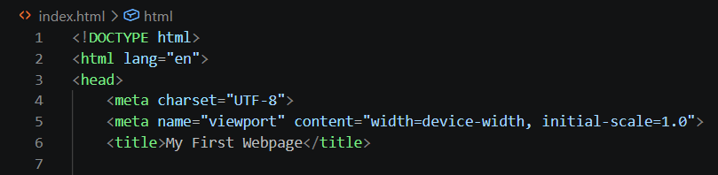

### Step 1. Structure text using HTML tags
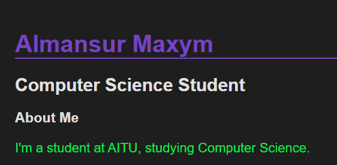

### Step 2. HTML Lists
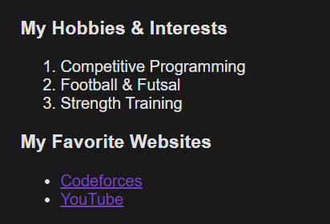

### Step 3. Images and Links
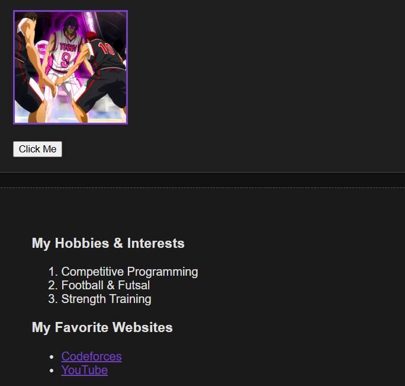

### Step 4. HTML Buttons
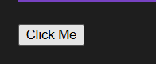

---

## Part 2. Intermediate HTML

### Step 5. Tables
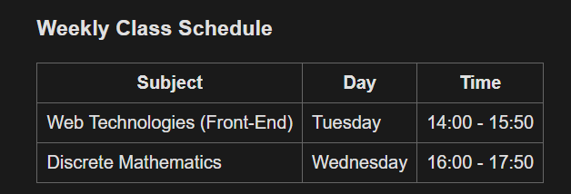

### Step 6. Using Tables for Layout
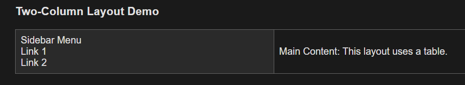

### Step 7. Typing Emojis
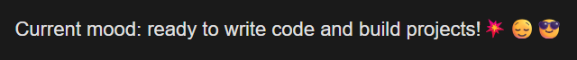

### Step 8. HTML Forms
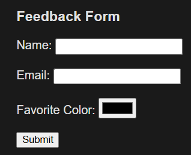

---

## Part 3. Introduction to CSS

### Step 9. Intro to CSS
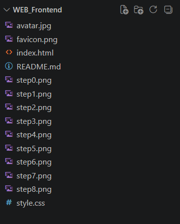

### Step 10. Inline CSS
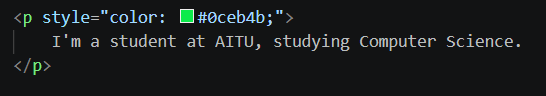

### Step 11. Internal CSS
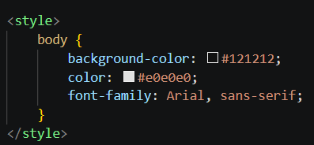

### Step 12. External CSS
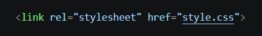

### Step 13. CSS Syntax & Selectors
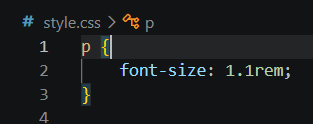

### Step 14. Classes vs. IDs
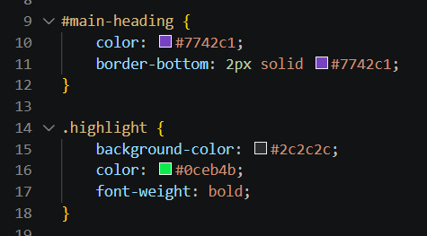

---

## Part 4. Intermediate CSS

### Step 15. Favicons

### Step 16. HTML Divs
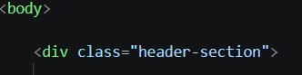

### Step 17. Box Model
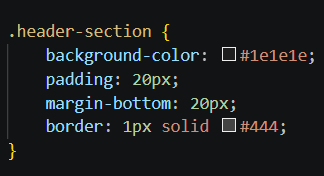

### Step 18. CSS Positioning
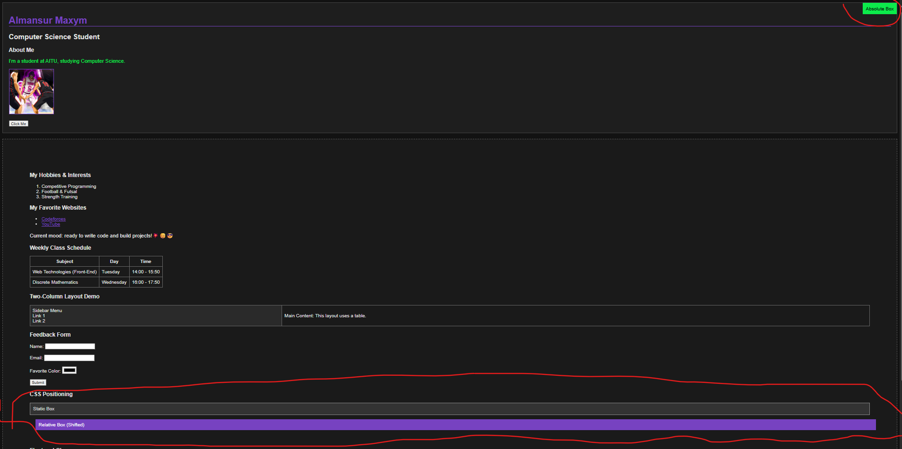

### Step 19. CSS Sizing
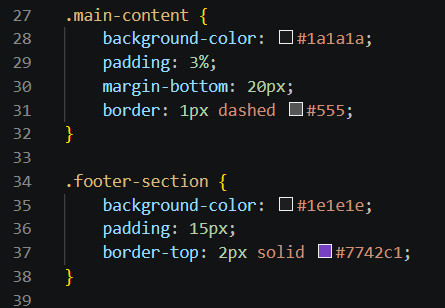

### Step 20. Float and Clear
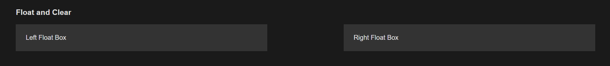

### Step 21. Publish Your First Website
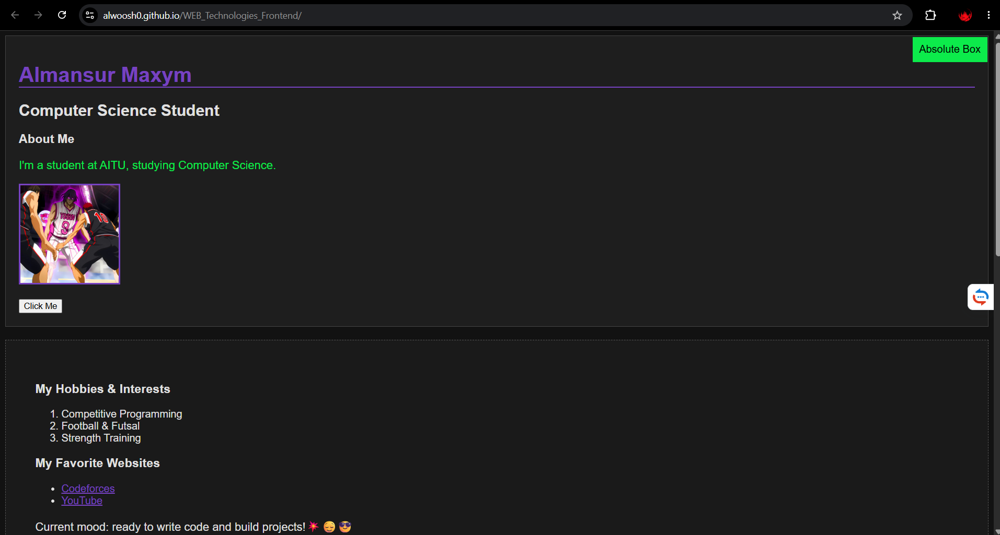

---

## Summary of work process
During this assignment, I created my first personal webpage from scratch using HTML5 and styled it with CSS3. I strictly followed the requirements to implement various HTML elements like forms, tables, lists, and images. I also successfully applied CSS concepts including the Box Model, use different units, positioning types, and basic float layouts.
